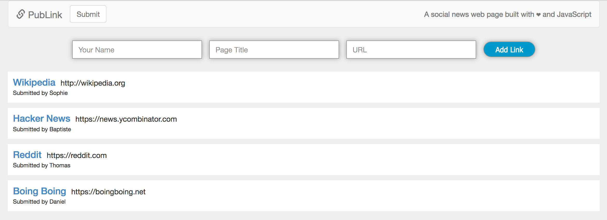
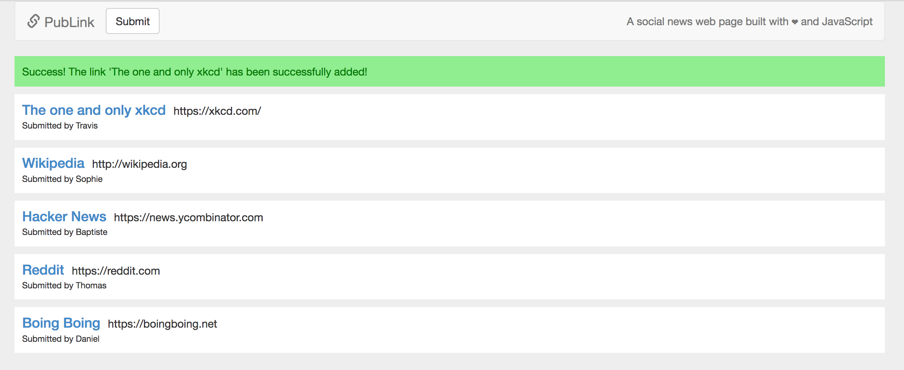

# Social News Web App

In my quest to learn more about Javascript I stumbled on an open source book: [The Javascript Way](https://github.com/bpesquet/thejsway).
The book itself is quite nice and covers a variety of beginner and more advanced topics.
Each major part of the book (there are currently three parts) has readers build a project.
Each part of the book continues with the same project, but the reader gets to add progressively more interesting and complex features.

Specifically, the *Social News* web app is meant to display a list of news links which, in theory,
    are submitted by various users of the app.
Upon visiting the webpage (submitting requests to the webserver),
    a collection of news links are sent to the browser.
The collection (formatted in JSON) is parsed and rendered on the screen.
The user can see basic information about the links and click them.


While on the webpage, a user can also submit new links by clicking the "Submit" button.
Once clicked, a form will be rendered where the submitter can enter some details about the link.
A link is defined by its title, its URL and its author (submitter).
Upon completion, there is some basic validation on the input data;
    the data is then sent to the webserver which can perform its own validation and add it to its collection
    of links that are served up to new clients that connect.
Regarding the form,
    there is some basic client-side feedback (success/failure of adding a new link, mandatory fields).





The webserver (built with Node.js) is responsible for handling requests from clients such as
    serving up web pages ("views") and sending/receiving information about news links.
The webserver uses Express.js to define routes which the webserver can handle
    (e.g., GET from "/", GET from "/api/news", POST to "/api/link").

The relevant project descriptions are linked below.
I skipped Part I as I was mostly interested in the client- and server-side concepts,
    and already had a decent foundation in the more fundamental aspects of Javascript.
* [Part I: Social News Program](https://github.com/bpesquet/thejsway/blob/master/manuscript/chapter11.md)
* [Part II: A Social News Web Page](https://github.com/bpesquet/thejsway/blob/master/manuscript/chapter19.md)
* [Part III: A Social News Web App](https://github.com/bpesquet/thejsway/blob/master/manuscript/chapter26.md)

## Getting started: repository overview & dependencies

The source code for this project is contained in this repository.

Building this project requires [npm](https://docs.npmjs.com/getting-started/installing-node)
    (`brew install npm` on macs if you are a homebrew user, or use your favorite package manager).
Once you have npm installed, run

```
npm install
```

which will use the `package.json` (and `package-lock.json`) to download all of the necessary dependencies into the `node_modules/` directory.
This *should* give you everything you need.

```
.
|-- README.md           <<< if you are reading this right now, you are reading this file! :)
|-- client.js
|-- link.js
|-- linklist.js
|-- node_modules
|   |-- ...snip...      <<< run `npm install` at the root of the project to download dependencies.
|-- package-lock.json
|-- package.json
|-- public
|   |-- bundle.js
|   `-- main.css
|-- server.js
|-- views
|   `-- index.html
`-- webpack.config.js    <<< see the section below on "using webpack..."
```

The primary files of interest are `views/index.html`, `client.js`, and `server.js`.
The former is the template HTML file provided in the book for [The Javascript Way](https://github.com/bpesquet/thejsway).
The latter two Javascript files are the client (frontend; i.e., "browser") and server (backend, Node.js) components, respectively.

### A quick test

Open a terminal, navigate to the root of this project, and run:

```
node server.js  # (or, try `npm start` and that will run the script in the package.json file)
```

You should see the following message: "Social News webserver is listening on port 3000."
Now, in your browser, visit [http://localhost:3000](http://localhost:3000).
If everything is working as it should, you'll see a webpage with 4 default news links (Wikipedia, Hacker News, etc.);
    it should look similar to the first picture shown in this README file above.

### Next steps

Try out the submission feature. Click "Submit", fill in the form, and then click "Add Link".
You'll see some feedback in the browser window and your link should be added to the web page.
Also, if you go back to your terminal you should be able to see some output that was logged to the console
    regarding the web request (shown in JSON format) and a bulleted list of the current entries in the list of news links.

## Using webpack to share code between client/server code

The code in `link.js` and `linklist.js` is code that *should* be used by both the client and server.
Specifically, these files contain class definitions and data structures for
    standardizing how the web app stores "Link" objects and maintains a collection of these objects.
Unfortunately, sharing is not as straightforward as one would hope.

I'll spare the gorey details and suffice it to say that [webpack](https://webpack.js.org/) is one tool that can help us here.
Since you have npm installed, you can get webpack easily:

```javascript
npm install webpack
```

Unfortunately, since I only installed it locally, simply running `webpack ...` doesn't work (the executable wasn't installed in, e.g., `/usr/bin/` which is in our PATH, which is one place where we expect to find our user executables).
This isn't a real problem though.
We can use the `webpack` executable that was installed in the `node_modules/` directory.
While the location of this executable does not reside in in our PATH,
    we use the `npm bin` command to identify the correct path to the local npm `bin/` directory,
    then invoke `webpack` to create a bundle.
If you are curious where the npm bin directory is,
    simply run that command by itself and it will print the path to the console.
Also note that if we create a file with the webpack configuration information, we can simply invoke `webpack` and
    the configuration file handles the details about entry points and where to put output files (see below):

```javascript
$(npm bin)/webpack
```

You'll notice from this configuration that we are trying to use good webserver practices.
Namely, any public content that the webserver serves up to clients should be in a dedicated folder (or folders).
In our case we have created a `public/` directory that contains any CSS or Javascript that the client will need.
Furthermore, the "views" that a client will be presented with are also stored in a dedicated folder.
In this case we have created a `views/` folder.

The webpack configuration file has been written to automatically drop the `bundle.js` file
    inside of `public/`.
The `server.js` script defines a static assets folder (`public/`)
    and a route to serve our HTML pages (in this app, that is simply the `views/index.html` file).

```
# webpack.config.js
module.exports = {
    entry: "./client.js",
    output: {
        path: `${__dirname}/public/`,
        filename: "bundle.js"
    }
};
```

## Future work

There are a number of things that would be fun to explore further.
A few ideas are briefly described below.

**Backend persistence**

Another feature I'm interested in exploring is persisting data that is sent to the webserver.
In its current form, the webserver will retain information only as long as it stays "up" (running),
    but if you kill the server, all of the added links will cease to exist.

**Better link information & features**

I'd like to add more information to the news links such as the time of submission and a brief description of the link.
It would also be cool to add a voting feature to track "up votes" on links.
I think this just requires a little busy work
  (updating data structures to hold additional information, adding a few new UI elements to input and display data).

It might even be cool to have different "themed news" lists (news by topic).
When adding links, the submitter could add a tag.
Links with related tags could be grouped together and users could request specific lists by tag
    (i.e., this is a sort of topical filter feature).

**More validation**

Currently the only validation that is done on new links that are submitted
    is to check to see if they begin with "http://" or "https://".
If not, then a default "http://" is added as a prefix.
It would be interesting, for example, to add an async call to check the page in the background
    and project client-side feedback before trying to submit the link.
Maybe some other stuff too? We'll see. 
